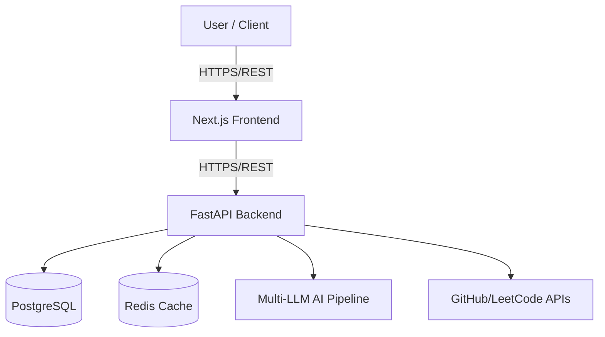

# CareerForge - AI-Powered Career Progression & Resume Engine

## Overview

**CareerForge** is an enterprise-grade platform that automates career progression. Beyond just resume generation, it is a holistic suite built to propel careers through intelligent insights, dynamic resumes, and automated profile syncing.

### 🚀 3 Core Features (Live Outcomes)

1. **AI-Driven Dynamic Resumes**: Automatically generate ATS-optimized, role-specific resumes precisely tailored to target job descriptions using our multi-LLM pipeline.
2. **Interactive Career Roadmaps**: Get personalized, step-by-step career progression paths identifying missing skills and suggesting the optimal path for promotion.
3. **Automated Cross-Platform Sync**: Instant synchronization of your achievements from GitHub, LeetCode, and Codeforces directly into your master profile, eliminating manual updates.

### Why CareerForge?

**Problem**: Applying to roles and managing career trajectory is fractured and repetitive. Applications get rejected by ATS systems, and keeping profiles updated takes hours.
**Solution**: Provide your base data once. CareerForge dynamically builds ATS-beating resumes and syncs your accomplishments continuously.
**Result**: Tangible increase in interview rates and clarity on skill gaps.

---

## 🏗️ System Architecture & Outcomes

### Technology Stack & Architecture

- **Frontend**: Next.js 16+ (React 18), Tailwind CSS, React Hook Form
- **Backend API**: Python FastAPI, SQLAlchemy ORM
- **AI Core**: Groq AI Engine (OpenAI/Anthropic ready fallback) for zero-latency generations.
- **Database**: PostgreSQL / SQLite
- **Infrastructure**: Docker Compose, GitHub Actions CI/CD ready.



For a comprehensive technical breakdown, see [`ARCHITECTURE_DESIGN.md`](./ARCHITECTURE_DESIGN.md).

---

## ⚡ Live Deployment / Quick Start

CareerForge is containerized so you can get a *live version* up and running instantly on any machine using Docker.

```bash
# 1. Clone repository
git clone https://github.com/yourusername/career-forge.git
cd career-forge

# 2. Launch Live Environment (starts DB, Cache, Backend, and Frontend)
docker-compose up --build -d
```

Your live app will be running instantly at:
- **Frontend App**: [http://localhost:3000](http://localhost:3000)
- **Backend API Docs**: [http://localhost:8000/docs](http://localhost:8000/docs)

*(Want to share it live on the web instantly? Run `npx localtunnel --port 3000`)*

# Windows: Run startup scripts
./start_backend.bat     # Terminal 1
./start_frontend.bat    # Terminal 2

# Linux/Mac:
python -m uvicorn backend.main:app --reload --port 8000  # Terminal 1
cd frontend && npm run dev                                # Terminal 2
```

**With Docker**:

```bash
docker-compose up -d
```

### Access the Application

| Service | URL | Purpose |
|---------|-----|---------|
| Frontend | http://localhost:3000 | User interface |
| Backend API | http://localhost:8000 | REST API |
| API Docs | http://localhost:8000/docs | Interactive Swagger UI |
| Database | `data/career.db` | SQLite database |

### Environment Setup

```bash
# Create .env file (copy from .env.example)
cp .env.example .env

# Required variables:
# JWT_SECRET - Generate: python -c "import secrets; print(secrets.token_hex(32))"
# GROQ_API_KEY - Get free key at https://console.groq.com
```

---

## API Documentation

The API is fully documented with interactive Swagger UI:

**Swagger UI**: http://localhost:8000/docs
**ReDoc**: http://localhost:8000/redoc

### Main Endpoints

| Method | Endpoint | Purpose |
|--------|----------|---------|
| `POST` | `/api/auth/signup` | Register new user |
| `POST` | `/api/auth/login` | User login |
| `POST` | `/api/auth/refresh` | Refresh JWT token |
| `GET` | `/api/auth/me` | Get current user |
| `POST` | `/api/resume/generate` | Generate AI resume |
| `GET` | `/api/resume/list` | List saved resumes |
| `GET` | `/api/jobs` | Get job applications |
| `POST` | `/api/jobs` | Add job application |
| `GET` | `/api/ai/generate` | AI content generation |
| `GET` | `/api/github/user` | GitHub profile import |
| `GET` | `/api/stats` | User statistics |

### Example API Calls

**User Signup**:

```bash
curl -X POST http://localhost:8000/api/auth/signup \
  -H "Content-Type: application/json" \
  -d '{
    "email": "user@example.com",
    "password": "SecurePass123",
    "name": "John Doe"
  }'
```

**Generate Resume**:

```bash
curl -X POST http://localhost:8000/api/resume/generate \
  -H "Authorization: Bearer YOUR_JWT_TOKEN" \
  -H "Content-Type: application/json" \
  -d '{
    "job_role": "Senior Software Engineer",
    "job_description": "We seek an experienced Python/Go developer..."
  }'
```

**Get User Profile**:

```bash
curl http://localhost:8000/api/auth/me \
  -H "Authorization: Bearer YOUR_JWT_TOKEN"
```

See [API Documentation](./docs/API.md) for complete endpoint reference.

---

## Development Workflow

### Project Structure

```
resume-builder/
├── backend/                   # FastAPI backend
│   ├── api/                   # API endpoints
│   │   ├── auth.py
│   │   ├── resume.py
│   │   ├── jobs.py
│   │   ├── ai.py
│   │   ├── github.py
│   │   ├── profile.py
│   │   ├── stats.py
│   │   ├── templates.py
│   │   ├── dynamic_resume.py
│   │   └── platforms.py
│   ├── services/              # Business logic
│   │   ├── resume_builder.py
│   │   ├── ai_engine.py
│   │   ├── github_parser.py
│   │   └── platform_sync.py
│   ├── core/                  # Core modules
│   │   ├── security.py        # JWT, encryption
│   │   ├── settings.py        # Configuration
│   │   ├── deps.py            # Dependencies
│   │   ├── logger.py          # Logging
│   │   ├── rate_limit.py      # Rate limiting
│   │   └── exceptions.py      # Error handling
│   ├── database/              # Data layer
│   │   └── models.py          # SQLite models
│   ├── main.py                # Application entry
│   └── requirements.txt
├── frontend/                  # Next.js frontend
│   ├── src/
│   │   ├── pages/             # Page components
│   │   │   ├── auth/
│   │   │   ├── resume/
│   │   │   ├── career/
│   │   │   └── dashboard.js
│   │   ├── components/        # Reusable components
│   │   ├── lib/               # Utilities
│   │   │   ├── api/
│   │   │   ├── context/
│   │   │   └── utils/
│   │   ├── hooks/             # React hooks
│   │   └── styles/            # CSS
│   ├── package.json
│   └── public/
├── infra/                     # Infrastructure
│   ├── docker/                # Docker configs
│   └── kubernetes/            # K8s manifests
├── docs/                      # Documentation
│   ├── API.md
│   ├── ARCHITECTURE_DESIGN.md
│   ├── DEPLOYMENT.md
│   ├── QUICKSTART.md
│   └── SECURITY.md
├── tests/                     # Test suite
│   ├── test_auth.py
│   ├── test_resume.py
│   ├── test_jobs.py
│   └── test_security.py
├── data/                      # Data storage
│   └── career.db              # SQLite database
├── docker-compose.yml         # Local dev setup
├── start_backend.bat          # Windows start script
├── start_frontend.bat         # Windows start script
├── .env.example               # Environment template
└── README.md
```

### Code Style

- **Python**: Black, isort, pylint
- **JavaScript**: Prettier, ESLint, Next.js conventions

```bash
# Format code
cd frontend && npm run format    # Frontend
black backend/                   # Backend

# Lint
cd frontend && npm run lint      # Frontend

# Test
cd frontend && npm test          # Frontend
pytest tests/                    # Backend
```

---

## Deployment

### Local Development

```bash
# Terminal 1: Backend
./start_backend.bat

# Terminal 2: Frontend
./start_frontend.bat

# Or with Docker Compose:
docker-compose up -d
```

### Cloud Deployment

See [Deployment Guide](./docs/DEPLOYMENT.md) for:

- **AWS**: ECS, RDS, CloudFront
- **Azure**: App Service, SQL Database
- **Kubernetes**: Full K8s deployment with Helm
- **CI/CD**: GitHub Actions pipelines

---

## Environment Variables

See [.env.example](./.env.example) for all configuration options.

**Required Variables**:

```bash
# Security
JWT_SECRET=<generate-with: python -c "import secrets; print(secrets.token_hex(32))">
JWT_ALGORITHM=HS256
JWT_EXP_MINUTES=120

# AI Provider (Free Groq API)
GROQ_API_KEY=<get-free-key-at-https://console.groq.com>

# CORS & URLs
CORS_ALLOW_ORIGINS=http://localhost:3000,http://127.0.0.1:3000
BACKEND_URL=http://localhost:8000
FRONTEND_URL=http://localhost:3000
```

**Optional Variables**:

```bash
# Email (for verification & password reset)
SMTP_HOST=smtp.gmail.com
SMTP_PORT=587
SMTP_USER=your-email@gmail.com
SMTP_PASS=your-app-password

# GitHub OAuth
GITHUB_CLIENT_ID=...
GITHUB_CLIENT_SECRET=...

# Monitoring
PROMETHEUS_ENABLED=false
SENTRY_DSN=...
```

---

## Testing

### Backend Tests

```bash
# Run all tests
pytest tests/

# Run with coverage
pytest --cov=backend backend/

# Run specific test
pytest backend/tests/test_api/test_auth.py::test_login
```

### Frontend Tests

```bash
# Run tests
npm test

# Watch mode
npm run test:watch

# Coverage
npm test -- --coverage
```

---

## Security

- **Authentication**: JWT tokens with refresh tokens
- **Authorization**: Role-based access control
- **API Keys**: Encrypted storage
- **HTTPS**: Required in production
- **Rate Limiting**: Per-user and per-IP
- **Input Validation**: Server-side validation with Pydantic
- **CORS**: Configurable origins
- **SQL Injection**: Protected via SQLAlchemy ORM
- **XSS**: React auto-escaping + CSP headers

---

## Contributing

1. Fork the repository
2. Create a feature branch
3. Commit your changes
4. Push to the branch
5. Submit a Pull Request

---

## License

This project is licensed under the MIT License - see [LICENSE](./LICENSE) file for details.

---

## Support & Community

- **Issues**: GitHub Issues
- **Discussions**: GitHub Discussions
- **Documentation**: [docs/](./docs/)

---

## Roadmap

- [ ] Cover letter generation
- [ ] Interview coaching AI
- [ ] Job board integration
- [ ] Resume analytics
- [ ] Team collaboration features
- [ ] Mobile app (React Native)
- [ ] Advanced customization options

---

**Start building better resumes today! 🚀**

## License

MIT — free to use, modify, and distribute.
